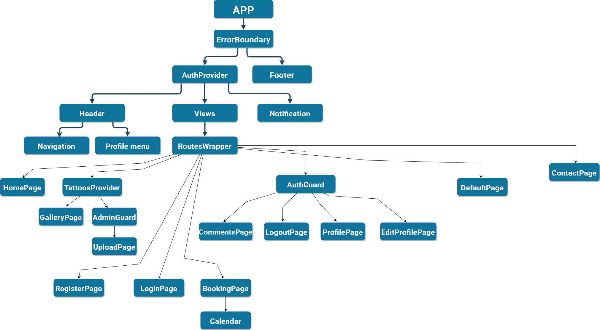

# Urban Tattoo Sofia

<p align="left">
  <a>
    
  </a>
  <a align="center" href="https://urban-tattoo-react.web.app/">DEPLOYED</a>
</p>

#### Front-end:
<p align="left">
  <a>
    
  </a>
</p>

#### Back-end:
<p align="left">
  <a>
    
  </a>
</p>

# Functionalities: 


ACCESS/FUNCIONALITY  | Visitor | User | Admin
-------------  | ------------- | ------------- | ------------- |
Gallery page(catalog)   |  |  | 
Booking page   |  |  |  
Contact page  |  |  | 
Profile page   |  |  | 
Edit profile page        |  |  | 
Upload page/upload file    |  |  | 
Create reservation |  |  | 
Like image |  |  | 
Create/Read/Update/Delete comment |  |  | 
<br>
<br>


Integrated user accounts for a personalized experience(making reservations and editing profile).

Created an image gallery with pagination for showcasing tattoos.

Developed RESTful APIs to handle user data, tattoos information and details.

Utilized MongoDB as the database to store and retrieve data efficiently.

# How to start application:

Type in the terminal
```
npm i
```
Install all dependecies and then go for:

```
npm run start
```

Open new terminal and type:
```
cd ./server
```
Install all dependecies for the server: 
```
npm i
```
Then run the server:

```
npm run server
```
# How to register admin:

```
on register form use: _admin for lastName !

```

<br>
<br>

# Structure:
<a>
    
</a>
